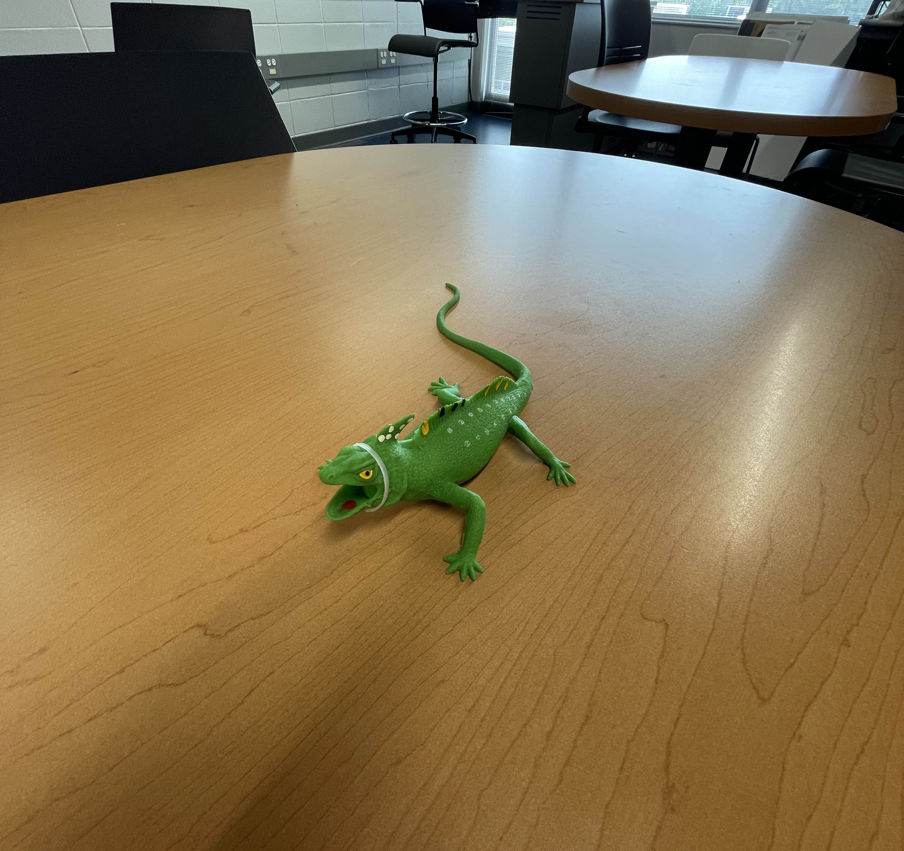

# Kaiju U-NDT

This is my team's EE senior design project. It is in very early development and will evolve into an autonomous immersion ultrasound NDT device.
The [pic0rick](https://github.com/kelu124/pic0rick) is used for the pulser/receiver

The name Kaiju came from a toy that randomly appeared in our lab one day



## Development
   If you are working on this project see [Setup](setup/README.md)

## To run the python scripts

1. **Clone the repo**
   Clone the repo (or download as zip) and cd into kaiju-ndt.

2. **Install Python and dependencies**
   - **Windows:** Download from [python.org](https://www.python.org/downloads/windows/) or run:
     ```bash
     winget install -e --id python.python.3.14
     ```
   - **MacOS:** Download from [python.org](https://www.python.org/downloads/macos/) or run:
     ```bash
     brew install python3
     ```
   - **Linux:** Install python with your package manager:
   Debian based:
   ```bash
   sudo apt install python3 python3-pip
   ```
   Arch:
   ```bash
   sudo pacman -S python python-pip
   ```
### Python dependencies
   - Open PowerShell or Terminal and run:
     ```bash
     pip install pyserial numpy matplotlib scipy h5py picodev
     ```

3. **Flashing the firmware**
   - If the firmware isn't already on the pico, you need to flash it.
   - Hold `BOOTSEL` and plug the board in. It should appear as `RPI-RP2`.
   - Drag and drop `firmware/pico/rp2040.uf2` (Pico) or `firmware/pico/rp2350.uf2` (Pico 2) into the `RPI-RP2` drive.
   - Or with picotool from the root of the repository:
   ```bash
   picotool load firmware/pico/rp2040.uf2
   ```

4. **Run a script**
   In PowerShell or Terminal:
   ```bash
   python3 python-tools/{script_name}.py
   ```

   If you use nix for some reason just:
   ```bash
   nix develop .
   python3 python-tools/{script_name}.py
   ```
